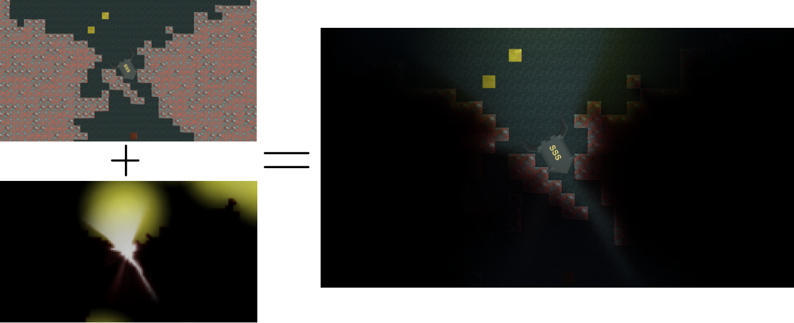
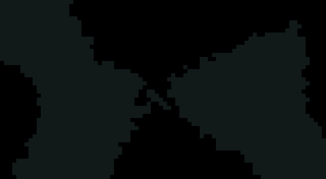
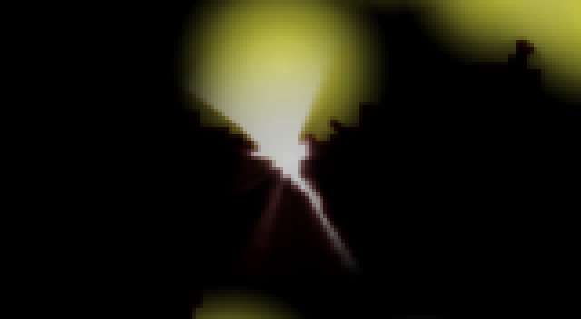
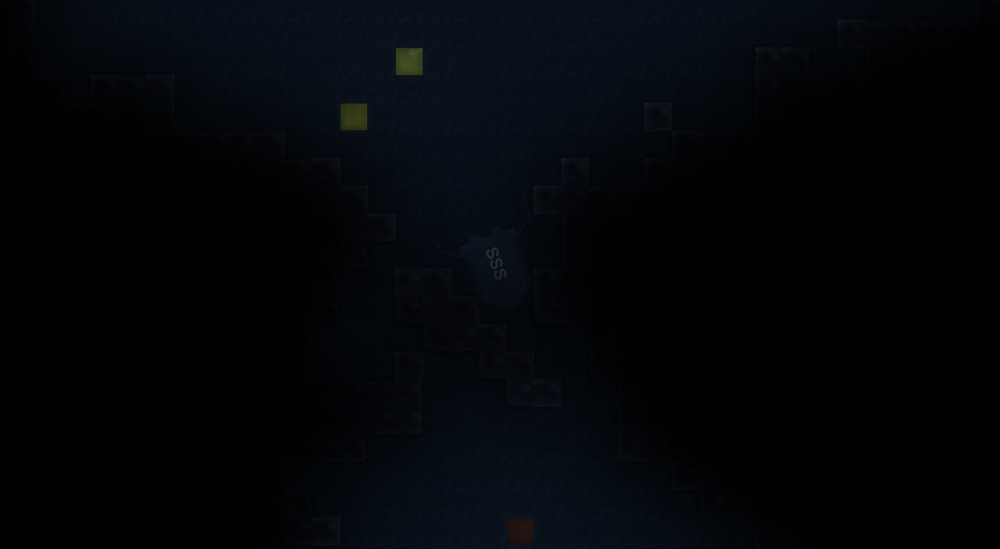

2D lighting system that performs computations on the GPU. This allows to get better lighting quality and use more lights, compared to some other 2D lighting systems.

[Asset Store link](https://www.assetstore.unity3d.com/en/#!/content/30953)

[Description in Russian](https://habrahabr.ru/post/248149/)

[Tutorial video](https://www.youtube.com/watch?v=ic5t2MFiowk)

## Features:
* It's fully dynamic: lights and obstacles could be moved in runtime. 
* Optimized for mobiles. 
* No need for physics colliders. 
* Light shape could be changed by changing light sprite. 
* Point, linear and ambient light types. 
* Colored lights and light obstacles. 
* Particle system support. 
* Normal mapping (too expensive for mobiles and not really tested). 
* Supports Unity 5. 

## How it works

Light is computed on small textures, 160x88 px size is used in this images. Quality of lighting is mostly depending on that resolution. When you increase it lighting will became more precise and will affect smaller light obstacles, but it will make computations more expensive.

Each frame system is rendering light obstacles, light sources, ambient light to RenderTextures. Then system mixes light sources and ambient light together and draws them as post effect.

### Light obstacles.

*Light obstacles texture (RGB). That and following textures is upscaled to 400%.*

Black areas are fully transparent for light, white is fully opaque. There is support for colors too, for example, fully red pixels would absorb red part of light and allow passing green and blue components unchanged.

### Light sources.

*Light sources texture.*

Light sources is a main part of lighting system. They are using GPU ray tracking on light obstacle texture to cast shadows. MeshRenderer draws light source with generated mesh of four vertices. Light emits from light origin, which could have point or line shape. Position of light origin is configurable.

Different shaders is used to draw light sources, with GPU ray tracking or without it. Shaders with ray tracking could have fixed or variable point count. Shader without ray tracking is used with particle systems.

### Ambient light.

*Ambient light texture.*

Opposite to light source, ambient light is emitting from whole area. For example, you could use ambient light to create minimal light level in caves without light sources. See areas unaffected by light sources in Rocket Example. They would be completely black without ambient light.

## Overall pros and cons.

**Pros:**
* Sprites is used as light sources. That means lights can have any shape.
* Light source is just a MeshRenderer with 4 vertices.
* Dynamic batching works with light sources.
* Point and line light emission types.
* Mobile device support. Rocket Example is using 8-10 ms per frame on Nexus 4 with profiler attached (where lighting itself taking 2-3 ms).
* Fully dynamic lighting system. That means you could create or destroy lights or light obstacles without a performance overhead (except Instantiate/Destroy itself).
* Ambient light support.
* Colored light sources and light obstacles.
* Variable light obstacles transparency.
* Support for light sources emission in Unity particle system.
* Flexible quality settings.
* Works with OpenGL ES 2.0 / DirectX 9.
* Supports Unity 5, 2D Toolkit.

**Cons:**
* Perspective camera mode is partially supported.
* Lights could ignore some small obstacles. Increasing resolution of render texture fixes that, however, can have a performance hit.
* System is creating 6-10 DrawCalls, depending on settings.
* Size of lighting camera must be bigger than of game camera by x1-x1.5. This is required to compute off screen lights correctly.
* It still consuming about 1 - 2ms per frame (on Nexus 4) when there is no lights on screen (if system is not disabled).

## Setup guide:

1) Create three layers: light sources, ambient light, light obstacles. You could do this in *Edit -> Project Settings -> Tags and layers*.

2) Press *GameObject / Light2D / Lighting system*. Enter layers you created in previous step.

2) !!!ONLY FOR 2D TOLLKIT!!! Press *GameObject -> Light2D -> Enable 2DTK Support*.

3) Adjust settings in `LightingSystem` script attached to main camera.

4) Add light sources, light obstacles and ambient light to scene.

Also you could watch tutorial https://www.youtube.com/watch?v=ic5t2MFiowk.

## How to use:

When you just created lighting system you will see black screen. To fix that you must add light sources or ambient light.

To add light source click *GameObject / Light2D / Light Source* and configure sprite / scale / color of created light. Then adjust *Light Pixel Size* in lighting system. Light sources is using path tracking to make shadows.

Next you cold add a light obstacle. To do this create sprite and set it's layer to *Light Obstacles* Layer or attach `LightObstacleGenerator` script to any `SpriteRenderer`. `LightObstacleGenerator` will create light obstacle from that sprite at runtime. Black obstacle is fully opaque, white is fully transparent. Colored obstacle will allow to pass some color components of light throught it. For example, red obstacle will make passing light red and absorb blue and green components.

*Ambient Light*. You could use ambient light to highlight big areas without light sources. To do that you need to create mesh / sprite renderer and set it's layer to *Ambient Light Layer*.

## Class reference:

`LightingSystem`. Main script for lights. Should be attached to camera. Handles lighting operation like camera setup, shader setup, merging cameras output together, blurring and some others.

`LightSprite`. Supplies data to light so it could render properly. Materials with *Light xxx* shaders require that script to be attached.

`LightObstacleGenerator`. That class is generating obstacles for object it attached to. Object must have MeshRenderer, SpriteRenderer or CustomSprite script from which texture for obstacle will be grabbed.

`LightObstacleMesh`. Automatically updating mesh, material and main texture of light obstacle. Class is copying all data used for rendering from parent.

`LightObstacleSprite`. Sprite with dual color support.

## LightingSystem settings:

*Light Pixel Size*. This value controls lighting texture size. Small values could cause poor performance. Will work correctly only when camera is in orthographic mode. When camera is perspective just tweak it until you get good results. Measured in Unity meters.

*Light Texture Height*. Height of texture that is used to compute lighting. Depends on *Light Pixel Size*. Measured in pixels.

*Light Camera Size Add*. Orthographic size of light camera will be bigger than of main camera by that value. Required to render off screen lights. Set it higher if light flickers when it's near screen corners. Lower it if you don't have such issues. Used only when camera is ortographic. Measured in Unity meters.

*Light Camera Fov Add*. Similiar to **Light Camera Size Add**, but for perspective camera. Field of view of light camera will be bigger than of main camera by that value. Measured in degrees.

*Enable Ambient Light*. Disable it if you don't use ambient lighting to increase performance.

*Blur Light Sources*. Applies blur to light sources render texture if checked. *Light Sources Blur Material* is used for blurring. Increases lighting quality, but uses one aditional DrawCall.

*Blur Ambient Light*. Applies blur to ambient light render texture if checked. *Ambient Light Blur Material* is used for blurring. Increases lighting quality, but uses one aditional drawcall.

*HDR (64 Bit Color)*. ARGBHalf render texture format will be used instead of ARGB32. That will increase color percision. Will be turned off if device is not supports it.

*Light Obstacles Antialiasing*. SSAAx4 will be used to draw light obstacles. That means light obstacles render texture size is doubled and downsampled after rendering. Adds one DrawCall.

*Light Textures Filter Mode*. Textures filtering mode. Set to *Point* to get pixelated lights.

*Ambient Light Compute Material*. Used for rendering ambient light. You could change some parameters in material. Here are they:

*Obstacle Mul*. *Obstacles color* is multiplied by that value.

*Obstacle Add*. Value is added to all components of obstacles color.

*Emission color mul*. Ambient light sources color is multiplied by that value.

*Average sampling distance*. Samping distance for iterative rendering of ambient light. Measured in UV coordinate units.

*Light Overlay Material*. Used for merging game and light textures together. You could change some parameters in material. Here are they:

*Light Sources Multiplier.* Light sources color is multiplied by that  value.

*Resulting Light Multiplier.* After merging light sources and ambient  light textures they are multiplied by that value.    

*Additive Light Pow.* Used for glow effect. Lesser value means more glow.

*Additive Light Add.* Used for glow effect. Bigger value means more glow.

*Light Sources Blur Material*. Used for light sources blurring.

*Ambient Light Blur Material*. Used for ambient light blurring.

*Light Camera*. Camera that will be used for light rendering.

*Light Sources Layer*. All renderers with that layer will be rendered to light sources texture.

*Ambient Light Layer*. All renderers with that layer will be rendered to ambient light texture.

*Light Obstacles Layer*. All renderers with that layer will be rendered to light obstacles texture.

## Normal Mapping.

There is two ways to use normal mapping:

1. Creating material and assigning it to `LightObstacleGenerator`.You should make a material with *Light2D/Transparent Normal Mapped* or *Light2D/Transparent Dual Color Normal Mapped* shader and set *Base* and *Normalmap* textures. Then you neeed to assign that material to *Material* field in `LightObstacleGenerator` script.

2. Creating material and assigning it to `MeshRenderer`. Requires a small shader modification or usage of special shaders (*Light2D/Transparent Normal Mapped* or *Light2D/Transparent Dual Color Normal Mapped*).

  If you want to add normal mapping to your own shaders add a line to `Properties` block

  `_MainTex ("Base (RGB) Trans (A)", 2D) = "white" {}`

  and another line to `SubShader/Tags` block

  `"LightObstacle"="True"`

*Note.* Height of light source is `LightSprite.LightOrigin.z`. Bigger height will cause smaller effect of normals.

*Limitations of normal mapping.* Normal mapping is much more expensive compared to standard lighting. Not supported on mobiles or with perspective camera. Normal texture should not be stored in atlas.

## Shaders:

*Light X Points*. These shaders have path tracking of X points. Bigger point count means better quality and lower GPU performance. Point count have no effect on CPU performance. Properties:

*Obstacle Mul*. Color of light obstacles is multiplied by that value. Greater value will make obstacles stronger. With zero all obstacles will be ignored.

*Emission color mul*. Color of the light source is multiplied by that value. Greater value will make light brighter.

*Light 1 Point*. Simple shader without path tracking. Could be used within particle system.

*Light Ignoring Obstacles*. This shader will ignore light obstacles. A bit faster than *Light 1 Point*.

*Light Auto Points*. Shader with variable path tracking points count. That shader could be used only on desktop because most of mobiles don't support it. This is most expensive shader, but it solves some quality issues on high resolution light textures or large lights.

*Unilt Transparent Dual Color*. Shader is similiar to standard *Unlit / Transparent*, but it have aditional vertex color. RGB components of that color is additive. Alpha is some mix between additive and multiplicative.

*Fast Blur*. Simple one pass blurring shader. Properties:

*Distance*. Blur distance in pixels.

*Ambient Light Computer*. Used to compute ambient light. Properties:

*Obstacle Mul*. Color of light obstacles is multiplied by that value. Greater value will make obstacles stronger. With zero all obstacles will be ignored.

*Obstacle Add*. Value is added to every pixel in fullscreen light obstacle texture. Greater values will make ambient light weaker.

*Emission Color Mul*. Color of ambient light is multiplied by that value. Greater values will make ambient light stronger.

*Average Sampling Distance*. Similiar to a blur distance.

*Light Overlay*. Used to merge game, ambient light and light sources textures together.

*Light Sources Multiplier*. Color of all light sources is multiplied by that value. Greater value will make light brighter.

*Resulting Light Multiplier*. Merged ambient light and light sources is multiplied by that value. Greater value will make all lighting brighter.

*Additive Light Pow*. Affects bloom. Zero will turn off bloom. Bigger values will make bloom threshold higher.

*Additive Light Add*. Bloom power. Bigger value will make stronger bloom.

## Tips:

Change background color in *Light Camera* to set minimal light level.

## Troubleshoting:

*Bad performance.* Increase *Light Pixel Size* or turn off some features like *64 Bit Color* in `LightingSystem`.

*Light obstacle is generated at wrong position.* Set sprite mesh type to full rect, turn off mip maps.

*Light is jerky with perspective camera.* Set `LightingSystem.CameraToLightObstaclesDistance` to distance from camera to light obstacles. Also all light obstacles should have same Z-depth.

## Hiring?
sss13594@gmail.com
